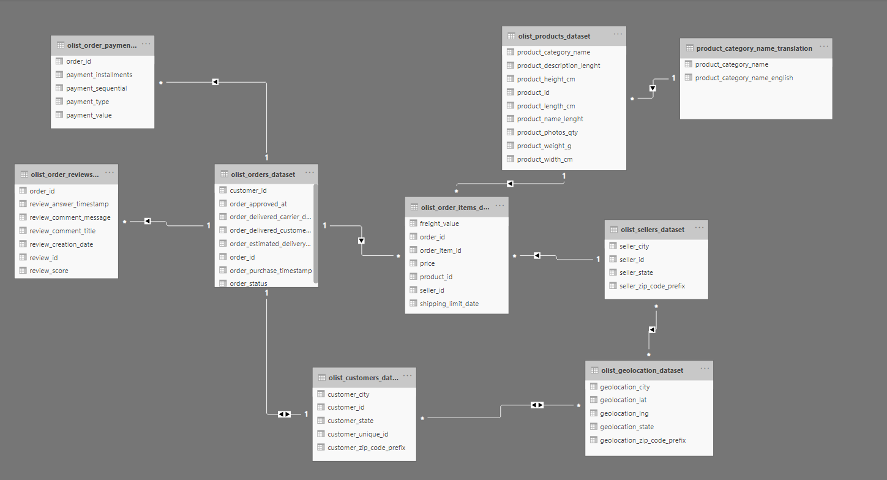

```{r setup, include=FALSE}
knitr::opts_chunk$set(echo = TRUE)
```

## About Olist
[Olist](http://www.olist.com/) operates an online e-commerce site for sellers, that connects merchants and their products to the main marketplaces of Brazil. It has developed a platform for shopkeepers of all sizes and segments to register their products to be sold at the Olist store within Brazil's top retailers. It's important to note that Olist:

- does not buy products.
- does not keep products in stock.
- does not carry out shipping of any products offered in its store.

This means that sellers are responsible for shipping products to customers.

Such business model might not be common in Vietnam, as here we have companies such as Tiki, Lazada or Shopee, which keep inventory, and either ship the products themselves or partner with a logistics service provider (GHN, GHTK).

## EDA

### Loading packages & data

For ease of referring to dataframes, I rename them as follow:

|original names|new names|
|--------------|---------|
|olist_order_payments_dataset|payments|
|olist_orders_dataset|orders|
|olist_order_review_dataset|reviews|
|olist_geolocation_dataset|geolocation|
|olist_customers_dataset|customers|
|olist_order_items_dataset|items|
|olist_products_dataset|products|
|olist_sellers_dataset|sellers|
|product_category_name_translation|translation|


```{r, message=FALSE, warning=FALSE, results='hide'}
# load packages
library(tidyverse, quietly = TRUE)
library(ggthemes, quietly = TRUE)
library(RColorBrewer, quietly = TRUE)
library(DT, quietly = TRUE)
library(knitr, quietly = TRUE)
library(kableExtra, quietly = TRUE)
library(lubridate, quietly = TRUE)
library(plotly)

set.seed(42) # to make report reproducible

file_path <- "D:/OneDrive/Personal/OneDrive/Projects/brazilian-ecommerce/data/"
file_list <- list.files(path=file_path)
name_list <- gsub(".csv", "", file_list)
# importing data

for(i in 1:length(file_list)){
  assign(name_list[i], 
         read_csv(file=paste0(file_path, file_list[i])
                  ))
}
```

### Overview of the data

There are in total 9 csv files, including 8 flat data tables and a lookup table used to translate product names to English. The relationship of 9 files can be shown as follow:


```{r, echo=FALSE, out.width='80%', fig.align='center', fig.cap="Brazilian E-commerce data"}

```
We start by examining each dataset and perform rough cleaning if necessary.


#### Payments dataset

```{r}
# dim(olist_order_payments_dataset)
cat("Dataframe dimension: ", dim(payments), "\n", 
    "Unique order ids: ", length(unique(payments$order_id)))
```

As shown above, we see that there are duplciated order ids, which is due to customer being able to pay with more than one method for one order. In this case, we use the `payment_sequential` column to indicate the payment method order. 


We also have other columns:

- `payment_type`: method of payment, including: credit card, debit card, voucher, not defined and boleto (which is [a payment method unique in Brazil](https://en.wikipedia.org/wiki/Boleto)).

- `payment_installment`: Amount of installments, which is only available to credit card method. Other methods would only have 1 installment by default.

- `payment_value`: self explanatory. Currency is in BRL (Brazilian real).

Next, we try to describe and visualize the datset:

__When we look at payment values__, we can see that the data are heavily skewed toward the left. It makes sense to graph these values on the log scale:

```{r, fig.show="hold", out.width='50%' }
payments <- payments %>%
    mutate(log_value = case_when(payment_value > 0 ~ log(payment_value),
                                 TRUE ~ 0))
ggplot(payments, aes(payment_value)) +
    geom_histogram(fill = "darksalmon", bins = 50) +
    labs(title = "Fig 1.1a: Distribution of payment value") +
    scale_x_continuous(breaks = seq(0,10000,by=2000))

ggplot(payments, aes(log_value)) +
    geom_histogram(fill = "darksalmon", bins = 50) +
    labs(title = "Fig 1.1b: Distribution of payment value - log scale")
```

__We would then be interested in how the data is distributed within different groups of payment types__. Note that one of the payment type is `not_defined`, for now we excluded them from the dataset. First, we look at the popularity of each method:

```{r, fig.show="hold", out.width='50%'} 
payments <- payments %>%
    filter(payment_type != "not_defined")

payments %>% 
  count(payment_type = factor(payment_type)) %>% 
  mutate(pct = prop.table(n)) %>%
  ggplot(aes(x = reorder(payment_type, pct), 
             y = pct,
             fill = payment_type,
             label = scales::percent(pct))) +
  geom_bar(stat = "identity") +
  labs(x = "Payment methods",
       y = "Proportion",
       title = "Fig 1.2a: Number of payments by method") +
  geom_text(position = position_dodge(width = .9),
            hjust = -.1,
            size = 3) +
  scale_y_continuous(labels = scales::percent,
                     limits = c(0,0.8)) +
  theme(legend.position = "none") +
  scale_fill_brewer(palette = "Set1") +
  coord_flip()

payments %>%
  group_by(payment_type) %>%
  summarise(total_value = sum(payment_value)) %>%
  ungroup() %>%
  mutate(pct = total_value/sum(total_value)) %>%
  ggplot(aes(x = reorder(payment_type, pct), 
             y = pct,
             fill = payment_type,
             label = scales::percent(pct))) +
  geom_bar(stat="identity") +
  labs(x = "Payment methods",
       y = "Total value",
       title = "Fig 1.2b: Payment value by method") +
  geom_text(position = position_dodge(width = .9),
            hjust = -.1,
            size = 3) + 
  scale_y_continuous(labels = scales::percent,
                     limits = c(0,0.82)) +
  theme(legend.position = "none") +
  scale_fill_brewer(palette = "Set1") +
  coord_flip()
```

As shown in Fig 1.1, most transaction has value in the $[0, 2000]$ range. For each payment method, we have:

```{r, fig.show="hold", out.width='50%'}

payments %>%
    ggplot(aes(x=1, y = payment_value)) +
    geom_jitter() +
    scale_y_continuous(breaks = seq(0,14000,by=2000)) +
    facet_grid(.~payment_type) +
    theme_minimal() +
    scale_color_brewer(palette = "Dark2",
                       name = "payment_type") +
    theme(axis.text.x=element_blank(),
          axis.ticks.x=element_blank()) +
    scale_x_continuous(position = "top") +
    labs(x = "Payment type",
         y = "Payment value",
         title = "Fig 1.3a: Distribution of payment value by method") 

ggplot(payments,aes(x=log_value, color = payment_type)) + 
    geom_density(size = 1) +
    theme_minimal() +
    scale_color_brewer(palette = "Set1") +
    labs(title = "Fig 1.3b: Distribution of payment value by method - log scale") +
    theme(axis.title.x=element_blank(),
          axis.title.y=element_blank())
```

__Next, we look at installment payments,__ which include payments with multiple installments and lump-sum payments (one installment). For the former, we can see in the charts below that payment value tends to be larger when there are more installments, which makes sense.

```{r, fig.show="hold", out.width='50%'}

payments %>%
  filter(payment_type == "credit_card") %>%
  group_by(payment_installments) %>%
  ggplot(aes(x=payment_installments, y=log_value, group = payment_installments)) +
  geom_boxplot()

payments %>%
  filter(payment_type == "credit_card") %>%
  group_by(payment_installments) %>%
  summarise(count = n(),
            mean_value = mean(payment_value)) %>%
  ggplot(aes(x=factor(payment_installments),
             y=mean_value)) +
  geom_bar(stat="identity", aes(fill=count)) +
  scale_fill_continuous(high = "#132B43", low = "#56B1F7")
```

As for one-time payment, things get more interesting as Boleto method makes up for only 38% of all orders, yet accounts for 49% of payment value, with average order size being 145 BRL, while credit has an average order size of 96 BRL. This might be explained by [lack of credit card ownership, distrust in providing card information to online systems, and discounts for Boleto payments](https://www.amcham.com.br/howtobr/pdfs/how-to-understand-payment-industry-in-brazil.pdf).

```{r, fig.align="center"}
p <- payments %>%
  filter(payment_installments == 1) %>%
  group_by(payment_type) %>%
  summarise(count = n(),
            value = sum(payment_value)) %>%
  ungroup() %>%
  mutate(count_pct = count/sum(count),
         value_pct = value/sum(value))
p %>%
  select(-count, -value) %>%
  gather("grouping", "pct", count_pct, value_pct) %>%
  arrange(payment_type) %>%
  ggplot(aes(x=payment_type, y=pct, fill=grouping, label = scales::percent(pct))) +
  geom_bar (stat="identity", position = position_dodge()) +
  labs(x = "Payment methods",
       y = "Percentage",
       title = "Fig 1.5: No. of orders vs. payment value for each method") +
  geom_text(position = position_dodge(width = .9),
            vjust = -.8,
            size = 3) + 
  scale_y_continuous(labels = scales::percent,
                     limits = c(0,0.55)) +
  scale_fill_discrete(labels = c("no. of order", "payment value")) +
  theme(legend.position = "bottom",
        legend.title = element_blank(),
        axis.title.x = element_blank(),
        axis.title.y = element_blank())

p %>% mutate(average_order_size = value/count) %>%
  kable() %>%
  kable_styling()
  

```

#### Orders & order items dataset

We examine the __orders__, __items__, and __products__ dataset together by joining them to create a new __order_items__ dataset, as they are closely related. 

```{r}
# Convert volume of each product to meter.
products <- products %>% 
  mutate(product_volume_m = product_length_cm*product_height_cm*product_width_cm/100)

# dim(olist_order_payments_dataset)
order_items <- items %>%
  left_join(orders, by = "order_id") %>%
  left_join(products, by = "product_id") %>%
  left_join(translation, by = "product_category_name")

cat("Order df dimension: ", dim(orders), "\n", 
    "Unique order ids: ", length(unique(orders$order_id)), "\n")

cat("Full order items df dimension: ", dim(order_items), "\n", 
    "Unique order ids: ", length(unique(order_items$order_id)), "\n")
```


The new df has duplicated `order_id`, which indicates that some orders have more than one items. If that is the case, we use the `order_item_id` to identify items within an order. For example:

```{r}
order_items %>%
  group_by(order_id) %>%
  filter(n() > 1) %>%
  arrange(order_id) %>%
  head(5)
```

At a glance, we want to know the average value of an order (Average order value):

```{r}

payments %>%
  group_by(order_id) %>%
  summarise(val = sum(payment_value)) %>%
  ungroup() %>%
  na.omit() %>%
  summarise(mean(val))

```


__Items per order.__ Most orders has 1 items, while some has 2-6 items. 

```{r}
order_items %>%
  count(order_id = factor(order_id)) %>%
  ggplot(aes(x=n)) +
  geom_bar(fill = "darksalmon") +
  labs(title = "Fig 2.1: No. of items per order frequency") +
  scale_x_continuous(breaks = seq(1,20, by=1)) +
  theme(axis.title = element_blank())

```

It is also useful to look at orders with bulk purchase (i.e. buy more than one of the same item) and orders with different items (note that they are not mutually exclusive).

```{r, fig.show="hold", out.width='50%'}
# bulk purchase

order_items %>%
  # select(order_id, order_item_id, product_id) %>%
  group_by(order_id) %>%
  filter(n() > 1) %>%
  group_by(order_id, product_id) %>%
  summarise(index_prd = n(),
            price = mean(price)) %>%
  group_by(index_prd) %>%
  summarise(count=n(),
            mean_price = mean(price)) %>%
  filter(index_prd > 1,
         count > 100) %>%
  ggplot(aes(x=factor(index_prd),
             y=count)) +
  geom_bar(stat="identity", aes(fill=mean_price)) +
  geom_text(aes(label=paste("(#",count,",",trunc(mean_price),"BRL)")),
                vjust=-.5,
                size=3) +
  labs(x = "Size of bulk order",
       y = "Frequency",
       title = "Fig 2.2a: No. of orders vs. payment value for each method") +
  scale_fill_continuous(name = "Mean price",
                        high = "#132B43", low = "#56B1F7") +
  scale_y_continuous(limits = c(0,5500))


order_items %>%
  # select(order_id, order_item_id, product_id) %>%
  group_by(order_id) %>%
  filter(n() > 1) %>%
  summarise(count_prd=length(unique(product_id))) %>%
  filter(count_prd > 1) %>%
  ggplot(aes(x=factor(count_prd))) +
  geom_bar(fill="brown1") +
  geom_text(stat="count",aes(label=..count..),
                vjust=-.5,
                size=3) +
  labs(x = "No. of different items",
       y = "Frequency",
       title = "Fig 2.2b: No. of different items in an order") +
  scale_y_continuous(limits = c(0,3000))


```

__Freight value and price.__. Freight value is the rate at which items is delivered (note that if an order has more than one item the freight value is splitted between items). For now we simply observe the data, but later we can use this in conjunction with geolocation data from the __geolocation__ dataset.

```{r, fig.show="hold", out.width='50%' }

order_value <- order_items %>%
  group_by(order_id) %>%
  summarise(freight_value = sum(freight_value),
            price = sum(price))

order_value <- orders %>%
  left_join(order_value, by = "order_id")


order_value %>%
  ggplot(aes(freight_value)) +
  geom_histogram(fill = "darksalmon", bins = 50) +
  labs(title = "Fig 2.3a: Distribution of freight value") +
  theme(axis.text.y = element_blank(),
        axis.ticks.y = element_blank(),
        axis.title.y = element_blank())

order_value %>%
  mutate(log_freight = case_when(freight_value > 0 ~ log(freight_value),
                                   TRUE ~ 0)) %>%
  ggplot(aes(log_freight)) +
  geom_histogram(fill = "darksalmon", bins = 50) +
  labs(title = "Fig 2.3b: Distribution of freight value - log scale") +
  theme(axis.text.y = element_blank(),
        axis.ticks.y = element_blank(),
        axis.title.y = element_blank())
```

For `price`:

```{r, fig.show="hold", out.width='50%' }

ggplot(order_value, aes(price)) +
  geom_histogram(fill = "dodgerblue", bins = 50) +
  labs(title = "Fig 2.3a: Distribution of item price")

order_value %>%
    mutate(log_price = case_when(price > 0 ~ log(price),
                                   TRUE ~ 0)) %>%
  ggplot(aes(log_price)) +
    geom_histogram(fill = "dodgerblue", bins = 50) +
    labs(title = "Fig 2.3b: Distribution of item price - log scale")
```

__Delivery time__, which can be measured in days. We observe that on average, delivery time is 11 days faster than that estimated.

```{r, warning=FALSE, fig.show="hold", out.width="50%"}

p <- orders %>%
  mutate(dlvr_time = time_length(interval(order_approved_at,
                                              order_delivered_customer_date), "day"),
         est_dlvr_time = time_length(interval(order_approved_at,
                                              order_estimated_delivery_date), "day")) 

p %>%
  select(order_id, dlvr_time, est_dlvr_time) %>%
  gather("type", "value", dlvr_time, est_dlvr_time) %>%
  ggplot(aes(x=value, color=type, fill=type)) +
  geom_density(alpha=0.25) +
  scale_x_continuous(breaks = seq(-100, 200, by=20))  +
  labs(title = "Fig 2.4a: Delivery time vs Estimated delivery time") +
  theme(legend.title = element_blank()) +
  scale_color_discrete(labels = c("Delivery time", "Estimated delivery time")) +
  scale_fill_discrete(labels = c("Delivery time", "Estimated delivery time"))

p %>%
  mutate(dif_dlvr_time = dlvr_time - est_dlvr_time) %>%
  ggplot(aes(x=dif_dlvr_time)) +
  geom_density(fill="darkseagreen3") +
  geom_vline(xintercept = 0,linetype="dashed") +
  scale_x_continuous(breaks = seq(-100, 200, by=20)) +
  labs(title = "Fig 2.4b: Difference in delivery time vs. estimated delivery time") 
  
p %>%
  filter(!is.na(order_approved_at),
         !is.na(order_delivered_customer_date)) %>%
  mutate(dif_dlvr_time = dlvr_time - est_dlvr_time) %>%
  summarise(mean(dif_dlvr_time),
            mean(dlvr_time),
            mean(est_dlvr_time))
```

__Price and freight value over time__. There are some observations we can make:

- There is a spike near the end of Nov 2018, which is around Black Friday.

- Over the long term, freight value tends to be stable, despite periods of increase in sales.

- There are slumps during year end, but usually resume the usual pace in January.

```{r, warning=FALSE,fig.width=9,fig.height=6,fig.align="center"}

order_day <- order_value %>%
  mutate(order_approved_day = as.Date(order_approved_at)) %>%
  group_by(order_approved_day) %>%
  replace_na(list(price=0,freight_value=0)) %>%
  summarise(price = sum(price),
            freight_value = sum(freight_value))

plot_ly(data=order_day,
        x =~order_approved_day,
        y =~price,
        name="price",
        mode = 'lines',
        type = "scatter") %>%
  add_trace(y = ~freight_value,
            name = "freight_value",
            mode = "line") %>% 
  layout(
    title = list(text = "Fig 2.5: Freight value & price over time", x = 1),
    legend = list(x = 0.1, y = 0.9),
    xaxis = list(
      rangeselector = list(
        buttons = list(
          list(
            count = 1,
            label = "1 mo",
            step = "month",
            stepmode = "backward"),
          list(
            count = 3,
            label = "3 mo",
            step = "month",
            stepmode = "backward"),
          list(
            count = 6,
            label = "6 mo",
            step = "month",
            stepmode = "backward"),
          list(
            count = 12,
            label = "12 mo",
            step = "month",
            stepmode = "backward"),
          list(step = "all"))),

      rangeslider = list(type = "date")),

    yaxis = list(title = "Value"))
```


#### Review dataset

The __review__ dataset can be use to calculate customer satisfaction and analyse customer sentiment based on text reviews.

Each review has a `review_id`, and all of them are associated with a `order_id`. The elements included are title, comment, date, and timestamp. Title and comment are (assume mostly) in Brazilian.

```{r}
glimpse(reviews)
```


#### Geolocation, customer and seller datasets

It makes sense to analyse these 3 datasets together, as the __customer__ and __seller__ datasets simply contain location information of respective parties.\

##### Customers

There are 2 id columns, and the other 3 columns are geolocation info.

- `customer_id`: is assigned to a customer each time he/she makes an order, and is the key to the __orders__ dataset. 

- `customer_unique_id`:  is the unique indentifier, i.e. stay the same for that particular customer, and is the key of this dataset. 

##### Sellers

Similarly, we have 1 id column and 3 geolocation columns.


##### Geolocation

We can see that the __geolocation__ dataset does not have a unique key, as the `geolocation_zip_code_frefix` has duplicates, as one zip code can have multiple lng/lat pairs.

```{r}

#check for duplicates
geolocation %>%
  group_by(geolocation_zip_code_prefix) %>%
  summarise(n=n()) %>%
  arrange(desc(n))
```


As such, we are going to take the average of these lng/lat data to get a coordinate. Moreover, after summarising the data, we can now easily map these zip codes to the __customers__ and __sellers__ table.


```{r}
geo_zc <- geolocation %>%
  group_by(geolocation_zip_code_prefix) %>%
  summarise(avg_lng = mean(geolocation_lng),
         avg_lat = mean(geolocation_lat)) %>%
  ungroup() %>%
  semi_join(select(geolocation,
                    geolocation_zip_code_prefix,
                    geolocation_city,
                    geolocation_state),
             by = "geolocation_zip_code_prefix")

glimpse(geo_zc)

```

When we map these coordinates on the map, we see that some outliers exists outside of Brazil, so we get rid of them.

```{r, warning=FALSE, message=FALSE}
# get rid of outliers

geo_zc <- geo_zc %>%
  filter(avg_lat <= 5.27438888,
         avg_lat >= -33.75116944,
         avg_lng <= -34.79314722,
         avg_lng >= -73.98283055)

glimpse(geo_zc)
# 
# geo_zc %>%
#     plot_ly(
#         lat = ~avg_lat,
#         lon = ~avg_lng,
#         mode = 'marker',
#         marker = list(color = "green"),
#         type = 'scattermapbox') %>%
#     layout(
#         mapbox = list(
#             style = 'open-street-map',
#             zoom =2.5,
#             center = list(lon = -43, lat = -22))) 

```

We can now have an overview of customers and sellers distribution geographically. We can see that most customers and sellers are located on the east coast, which aligns with the general population of Brazil. Details about the population can be found [here](http://worldpopulationreview.com/countries/brazil-population/#popDensityMap).


```{r, warning=FALSE, message=FALSE, fig.show="hold",out.width="50%"}

customers <- customers %>%
  left_join(geo_zc, by = c("customer_zip_code_prefix" = "geolocation_zip_code_prefix")) %>%
  rename(cust_lat = avg_lat,
         cust_lng = avg_lng)

customers %>%
  plot_ly(
    lat = ~cust_lat,
    lon = ~cust_lng,
    mode = 'marker',
    marker = list(color = "fuchsia"),
    type = 'scattermapbox') %>%
  layout(
    mapbox = list(
        style = 'open-street-map',
        zoom =2.5,
        center = list(lon = -43, lat = -22))) 
  
sellers <- sellers %>%
  left_join(geo_zc, by = c("seller_zip_code_prefix" = "geolocation_zip_code_prefix")) %>%
  rename(seller_lat = avg_lat,
         seller_lng = avg_lng)

sellers %>%
  plot_ly(
    lat = ~seller_lat,
    lon = ~seller_lng,
    mode = 'marker',
    marker = list(color = "darksalmon"),
    type = 'scattermapbox') %>%
  layout(
    mapbox = list(
        style = 'open-street-map',
        zoom =2.5,
        center = list(lon = -43, lat = -22))) 
```


#### Master dataset

It's also useful to have a master dataset to use in later sections.

```{r}
master <- order_items %>%
  mutate(invoice = price + freight_value) %>%
  left_join(reviews, by = "order_id") %>% 
  left_join(customers, by = "customer_id") %>% 
  left_join(payments, by = "order_id") %>% 
  left_join(sellers, by = "seller_id") %>% 
  select(customer_id,
         customer_unique_id,
         order_id,
         order_item_id,
         order_status,
         order_purchase_timestamp,
         order_approved_at,
         order_delivered_carrier_date,
         shipping_limit_date,
         order_delivered_customer_date,
         order_estimated_delivery_date,
         product_id,
         product_category_name_english,
         product_weight_g,
         product_volume_m,
         price,
         freight_value,
         invoice,
         review_score,
         payment_type,
         customer_zip_code_prefix,
         customer_city,
         customer_state,
         cust_lat,
         cust_lng,
         seller_id,
         seller_zip_code_prefix,
         seller_city,
         seller_state,
         seller_lat,
         seller_lng) %>%
  rename(order_date = order_purchase_timestamp,
         appr_date = order_approved_at,
         limit_date = shipping_limit_date,
         inv_date = order_delivered_carrier_date,
         receipt_date = order_delivered_customer_date,
         est_date = order_estimated_delivery_date,
         cust_zip = customer_zip_code_prefix,
         seller_zip = seller_zip_code_prefix,
         prd_category = product_category_name_english,
         cust_city = customer_city,
         cust_state = customer_state) %>%
  mutate(order_date = date(order_date),
         appr_date = date(appr_date),
         limit_date = date(limit_date),
         inv_date = date(inv_date),
         receipt_date = date(receipt_date),
         est_date = date(est_date),
         order_appr = appr_date - order_date, # duration from order to approve
         appr_limit = limit_date - appr_date, # duration from approve to expected start shipping
         appr_inv = inv_date - appr_date, # duration from approve to actual start shipping
         limit_receipt = receipt_date - limit_date, # duration from expected shipping to receipt
         inv_receipt = receipt_date - inv_date, # duration from start shipping to receipt
         order_est = est_date - order_date, # duration from order to estimated receipt
         order_receipt = receipt_date - order_date, # duration from order to actual receipt
         receipt_est = est_date - receipt_date, # difference between receipt & estimate
         inv_limit = limit_date - inv_date # difference between expected start shipping & actual
         )

glimpse(master)

```

## Identifying key metrics and Analysis

### Proposal of metrics

The main strategy of the company is to maximize Gross Merchandise Value and optimize spending. With the datasets' limitations, we can narrow down to the following topics, each comes with suitable metrics:

1. Logistics/Supply chain management: Analysing the metrics below can help us optimize the supply chain, e.g. which locations/areas is optimal (in terms of distance/speed) for delivery.

    - Lead time:
    
    - Backorder rate:

  
2. Profit maximization: CLTV helps the company find which customer segments yield highest profit.
    
    - Customer Lifetime Value (CLTV): CLTV is a prediction of the net profit attributed to the entire future relationship with a customer, i.e. PV of future cash flows associated with the customer.
  
    
3. Customer satisfaction: Within the scope of this test, I will not cover customer satisfaction, which revolves around analysis of review score and independent variables.
    

### Analysis

#### Supply chain

##### Objectives

From exploring the data in the first section, we can see that each customer has to pay a freight rate for shipping, and this rate is most definitely affected by distance between sellers and customers.

Remember as we discuss from the beginning that Olist neither keeps stocks nor ships products itself. The company simply functions as a middleman that connects sellers and buyers. This leads to a difficult problem of optimizing metrics such as lead time. We have explored that the average lead time is almost 12 days, which is much longer than that of other e-commerce companies in Vietnam. 

The objective of this section is:

- Calculate important supply chain metrics, including lead time and backorder rate. These metrics can be used for tracking purpose and are useful in an overview dashboard.

- To identify areas where shipping is fastest/most optimal and provide recommendations for the company to shift its strategy to cater to these areas more.


##### Preparing data

For this task, we clean master data again and write it to csv to use later.

```{r}
# 
# master <- master %>% 
#   mutate(
#     receipt_week = lubridate::as_datetime(order_date))

master <- master %>% 
  filter(receipt_date < ymd('2018/08/29')) %>% 
  mutate(
    delivered_week = lubridate::week(ymd(receipt_date)),
    delivered_year = as.factor ( lubridate::year(ymd(receipt_date)) ),
    backorder = ifelse(receipt_est < 0, 1, 0),
    purchase_week = lubridate::week(ymd(order_date)),
    purchase_year = as.factor ( lubridate::year(ymd(order_date)) )
         )

write.csv(master, file = "./master.csv")
```

##### Analysis

###### Lead time

Lead time can be defined as the latency between initiation and execution of product delivery. 

Overview:

```{r}

LT2 <- master %>% 
  select(delivered_week,
         delivered_year,
         order_appr,
         appr_inv,
         inv_receipt,
         cust_state) %>% 
  gather(order_appr, appr_inv, inv_receipt,
         key="LT", value="days" )%>% 
  na.omit() %>% 
  group_by(delivered_year, delivered_week, LT) %>% 
  summarise(mean2 = mean(days)) %>%
  ungroup()

ggplot(LT2, aes(x=LT))+
  geom_density()

```

Average delivery days for each state.

```{r, warning=FALSE, message=FALSE}
# average delivery days per state
dlvr_days_state <- master %>% 
  group_by(cust_state) %>% 
  summarise(a = mean(order_est), b = mean(review_score))

ggplot(dlvr_days_state, aes(cust_state, a ,group=cust_state))+
  geom_bar(stat="identity",aes(reorder(cust_state, -a, sum),fill=a))+
  scale_fill_gradient(low="#56B1F7", high='black')+ 
  labs(title="Average Delivery Days per State", 
       x = 'State',
       y = 'Day') +
  theme(legend.position = "none",
        axis.text.x = element_text(angle=45, vjust=0.6),
        plot.title = element_text(hjust = 0.5))

```

Average order to approve time for most prominent product categories.

```{r, message=FALSE, fig.show="hold", out.width="50%"}

per_category <- master %>% 
  gather('order_receipt','appr_inv','inv_receipt',key='LT',value=days )

per_category %>% 
  filter(LT=='order_receipt') %>% 
  na.omit %>% 
  group_by(prd_category) %>% 
  summarise(a=mean(days)) %>% 
  arrange(desc(a)) %>%
  filter(a>12) %>%
  ggplot(aes(prd_category,a,group=prd_category))+
  geom_bar(stat="identity",aes(reorder(prd_category, -a, sum),fill=a))+
  scale_fill_gradient(low="#56B1F7", high='black')+ 
  labs(title="Average order to receipt per Category", 
       x = 'State',
       y = 'Day') +
  theme(legend.position = "none",axis.text.x = element_text(angle=45, vjust=0.6), plot.title = element_text(hjust = 0.5))

per_category %>% 
  filter(LT=='appr_inv') %>% 
  na.omit %>% 
  group_by(prd_category) %>% 
  summarise(a=mean(days)) %>% 
  arrange(desc(a)) %>%
  filter(a>2.7) %>%
  ggplot(aes(prd_category,a,group=prd_category))+
  geom_bar(stat="identity",aes(reorder(prd_category, -a, sum),fill=a))+
  scale_fill_gradient(low="#56B1F7", high='black')+ 
  labs(title="Average approve to inventory per Category", 
       x = 'State',
       y = 'Day') +
  theme(legend.position = "none",axis.text.x = element_text(angle=45, vjust=0.6), plot.title = element_text(hjust = 0.5))

```


Next we see how delivery times change each year in the 3 charts below. 


```{r, message=FALSE}
deliveryDays <- master %>% 
  na.omit %>% 
  group_by(delivered_year, delivered_week) %>% 
  summarise(m_order_est = median(order_est),
            m_order_limit = mean (order_appr + appr_limit) )

ggplot() +
  geom_col(data=filter(LT2, delivered_year==2016),
           aes(x=delivered_week, y=mean2, fill=LT)) +
  geom_line(data=filter(deliveryDays, delivered_year==2016),
            aes(x=delivered_week,
                y=m_order_est),
            linetype = "dashed",
            size = 1)

ggplot() +
  geom_col(data=filter(LT2, delivered_year==2017),
           aes(x=delivered_week, y=mean2, fill=LT)) +
  geom_line(data=filter(deliveryDays, delivered_year==2017),
            aes(x=delivered_week,
                y=m_order_est),
            linetype = "dashed",
            size = 1)

ggplot() +
  geom_col(data=filter(LT2, delivered_year==2018),
           aes(x=delivered_week, y=mean2, fill=LT)) +
  geom_line(data=filter(deliveryDays, delivered_year==2018),
            aes(x=delivered_week,
                y=m_order_est),
            linetype = "dashed",
            size = 1)
```

We can see that delivery time tends to increase near the end of the year when there are more shopping activities.

- We notice that estimated time, or the required delivery time (dashed line) is set too far off from actual times. The average estimated delivery date is approximately 25 days from order. If such gap is large, it would be difficult for sellers to prioritize which orders should be fulfill first, particularly when stocks are low.

- The time from carrier starts shipping to customer receiving products is about 9 days (green bar / `appr-inv`). This takes up approximately 73% of entire delivery process. It's likely that carriers have their own warehouse system and use it to allocate goods for shipping, which is similar to some carriers in Vietnam. However, they hold on to products for too long, which might indicate inefficiency in inventory management, leading to warehousing expenses, opportunity loss and risk of theft (as is the case in Brazil).

It's also useful to look at sale peaks through the year, and we can see that the peaks are consistent in 2017 and 2018.

```{r}

sales <- master %>%
  na.omit %>%
  group_by(purchase_year, purchase_week) %>% 
  summarise(sale = sum(price))

n <- dim(sales)[1]

sales <- sales %>% 
  arrange(purchase_year,purchase_week)

sales<-sales[1:(n-5),]

sales <- sales %>% 
  ungroup() %>% 
  mutate(purchase_year = as.factor(as.character(purchase_year)))


ggplot()+
  geom_line(data = sales, aes(x=purchase_week, y=sale/1000, color=purchase_year),size = 1) +
  coord_cartesian(xlim = c(1,48)) +
  labs(title='Sales History', x = 'Week Number', y = 'BRL (1K)', color = 'Year') + 
  theme(legend.key=element_blank(), plot.title = element_text(hjust = 0.5)) +
  annotate("rect", xmin = 1, xmax = 4, ymin = 0, ymax = 400, alpha = .2, fill='darkgreen')+
  annotate("rect", xmin = 46, xmax = 49, ymin = 0, ymax = 400, alpha = .2, fill='darkgreen') +
  annotate("rect", xmin = 18, xmax = 21, ymin = 0, ymax = 400, alpha = .2, fill='darkgreen') +
  annotate("rect", xmin = 22, xmax = 25, ymin = 0, ymax = 400, alpha = .2, fill='darkgreen') +
  annotate("rect", xmin = 28, xmax = 31, ymin = 0, ymax = 400, alpha = .2, fill='darkgreen') +
  annotate("rect", xmin = 8, xmax = 11, ymin = 0, ymax = 400, alpha = .2, fill='darkgreen')
```

###### Backorder rate

Backorder Rate measures how many orders cannot be filled at the time a customer places them. This is measured by frequency of orders delivered later than the estimated delivery date as mentioned above. The chart below has a dotted line drawn for an ideal minimum rate of 5%, however this is only arbitrary.

```{r}

backorder_rate <- master %>% 
  group_by(delivered_year, delivered_week) %>% 
  mutate(orderCount = n(),
         backorder = sum(receipt_est<0),
         backorder_ratio = backorder/orderCount) %>% 
  select(prd_category,cust_state, seller_id, delivered_week, delivered_year,backorder, backorder_ratio, review_score) %>% 
  ungroup() %>% 
  na.omit() %>% 
  mutate(delivered_year = as.factor(delivered_year))

# back-order rate per year
ggplot()+
  geom_line(data = backorder_rate,
            aes(x=delivered_week, y=backorder_ratio, color=delivered_year),
            size = 1) +
  geom_hline(yintercept = 0.05,linetype="dashed") +
  labs(title='Backorder Rate',
       x = 'Week Number',
       y = 'Ratio(%)',
       color = 'Year') +
  coord_cartesian(xlim = c(2,49)) +
  scale_y_continuous(labels=scales::percent) +
  theme(legend.key=element_blank(), plot.title = element_text(hjust = 0.5)) 

# 
# backorder_rate %>% 
#   group_by(prd_category) %>% 
#   summarise(count=n(),mean(review_score)) %>% 
#   arrange(desc(count))
# 
# master %>%
#   filter(GRvRDD>0) %>% 
#   summarise(mean(review_score))
```

We can see that backorder that is likely to increase in peak seasons.


###### Optimized location

As we can see above, there is an opportunity to reduce delivery time, particularly reducing time from leaving inventory (start shipping) to actual receipt. This leads to a question:

> If we could pick an ideal location for warehousing, where should it be? Or, if we could identify current locations that are doing the best in terms of delivery, where are they?

In this part, I use the K-mean clustering method to cluster customer geolocations and find the cluster centroid. The central location of each cluster indicates an ideal location for warehousing. 

We use the elbow method to define the number of clusters. Below is the ideal carrier/warehouse locations per each cluster of 5, as $k=5$ has small sum-squared error while $k$ remains low (at the elbow).

```{r}
master %>% 
  na.omit() %>% 
  select(cust_lat,cust_lng)-> cluster_df

# dim(master %>% na.omit)

test1 <- scale(na.omit(data.matrix(cluster_df)))
data <- test1

k.max <- 10
wss <- sapply(1:k.max, function(k){kmeans(data, k, nstart=30,iter.max = 10 )$tot.withinss})
plot(1:k.max, wss,type="b", pch = 19, frame = FALSE, xlab="Number of clusters K", ylab="Total within-clusters sum of squares")


# k-means with k=5, as k=5
clusters <- kmeans(cluster_df,5)
# bring cluster data into df
cluster_df$clusters <- as.factor(clusters$cluster)

ggplot(cluster_df, aes(x=cust_lng, y=cust_lat, color=clusters)) +
  geom_point(alpha=.3)+
  coord_cartesian(xlim = c(-70,-35), ylim = c(-35,10)) + 
  geom_density_2d()

```

From the result above, we can compute the location for ideal warehouse.

```{r}

WH_coordinate <-  as.data.frame(clusters$centers)

# use google maps to get city from coordinates!!! lol
carrier_city<- c('Campos Novos', 'Serrita','Britânia', 'Guarani', 'Campinas')


m <- clusters$size / sum(clusters$size)
ratio_of_orders <- paste(round(100*m, 2), "%", sep="")

WH_coordinate <- cbind(WH_coordinate,
                       carrier_city,
                       ratio_of_orders)
WH_coordinate %>%
  kable() %>%
  kable_styling()
```

##### Discussion

Using K-mean clustering and data exploration, I have computed lead time, backorder rate, ideal WH locations, and draw some insights regarding these metrics. To recap:

- The gap between required delivery time and actual delivery is large, which makes it difficult for sellers to prioritize which orders should be fulfill first, particularly when stocks are low. Moreover, a gap that large is likely meaningless. It's also useful to know how such number is computed.

- Carriers hold on to products for too long, which might indicate inefficiency in inventory management, leading to warehousing expenses, opportunity loss and risk of theft (as is the case in Brazil).

- Backorder rate usually stays below 5%, but experiences huge spike during peak seasons.

__As for limitation of the analysis__: K-mean clustering might not be useful when dealing with locations far from the equator, because the coordinates are distorted when the map is flattened. However, in this case, Brazil is reasonably near the equator.

#### Profit maximization - CLTV prediction

##### Objectives

The goal of this task is to build a model for forecasting CLTV, so that the company can:


- Segment customers into active and inactive groups.

- Generate transaction forecasts for individual customers.

- Predict the purchase volume of the entire customer base.


##### RFM analysis

We use the RFM method, which stands for "Recency, Frequency & Monetary". In R, RFM analysis can be conducted using the `BTYD` and `BTYDplus` package.

As for data, we join the __customers__ and the __order_items__ dataset. We start by creating an event log of customer purchases and plot it to find timing patterns. Besides, the event log, there is also the transaction log which add `sales` data.

```{r}
library(BTYDplus, quietly = TRUE) # use for customer analysis
library(BTYD, quietly = TRUE)

order_value <- select(payments, order_id, payment_value) %>%
  group_by(order_id) %>%
  summarise(payment_value = sum(payment_value))

customer_value <- orders %>%
  select(customer_id, order_id, order_purchase_timestamp) %>%
  left_join(order_value,
             by = "order_id") %>%
  inner_join(select(customers, customer_id, customer_unique_id),
             by = "customer_id") %>%
  rename(order_date = order_purchase_timestamp) %>%
  mutate(order_date = as.Date(order_date))

elog <- customer_value %>%
  select(customer_unique_id,
         order_date) %>%
  rename(cust = customer_unique_id,
         date = order_date)

# summary(elog)

tlog <- customer_value %>%
  select(customer_unique_id,
         order_date,
         payment_value) %>%
  rename(cust = customer_unique_id,
         date = order_date,
         sales = payment_value)
  

plotTimingPatterns(elog,
                   n = 100,
                   T.cal = "2018-06-30",
                   headers =c("Past", "Future"),
                   title = "Timing patterns for sampled customers")
```

The transaction log looks as below:

```{r}
head(tlog)
```

###### Weekly transactions

Before starting to fit probabilistic models, we might be interested in reporting the total number of transactions over time, to gain a first understanding of the dynamics at a cohort level. 


```{r, fig.show="hold", out.width="50%"}
# incremental
weekly_inc_total  <- elog2inc(elog, by = 7, first = TRUE)
weekly_inc_repeat <- elog2inc(elog, by = 7, first = FALSE)
plot(weekly_inc_total, typ = "l", frame = FALSE, main = "Incremental")
lines(weekly_inc_repeat, col = "red")

# cumulative6
weekly_cum_total  <- elog2cum(elog, by = 7, first = TRUE)
weekly_cum_repeat <- elog2cum(elog, by = 7, first = FALSE)
plot(weekly_cum_total, typ = "l", frame = FALSE, main = "Cumulative")
lines(weekly_cum_repeat, col = "red")
```

The two charts above show that there are a significant amount of customers who only have one single purchase over the measured period, as the gap between the red line (=repeat transactions)and the black line (=total transactions) illustrates the customers’ initial transactions.

###### Statistical modelling

We start by convert the event log to CBS (customer-by-sufficient-statistic) format, with a row for each customer. This is the required data format for estimating model parameters. In this table, `x` is the number of repeat transactions (i.e., frequency), `t.x` is the time of the last recorded transaction (i.e., recency), `x.star` represents the number of repeat transactions during the holdout period of length `T.star`.

```{r}
cbs <-elog2cbs(tlog, T.cal = "2018-06-30")

head(cbs)
```

Next, we use the __MBG/CNBD-k__ model and compute its parameters.

```{r}
params.mbgcnbd  <- mbgcnbd.EstimateParameters(cbs)

row <- function(params, LL) {
  names(params) <-c("k", "r", "alpha", "a", "b")
  c(round(params, 3), LL =round(LL))
}

row(params.mbgcnbd, mbgcnbd.cbs.LL(params.mbgcnbd, cbs))

```

We use the __MBG/CNBD-k__ model to predict CLTV. This model assumes that a customer’s intertransaction times, while being active, are Erlang-k distributed, with purchase rate $\lambda$ being $Gamma(r,\alpha$)$-distributed across customers.

###### Estimating customer lifetime value using the Gamma-Gamma model

Calculate:

1. The expected transaction value for a customer, conditional on the number of transactionand average transaction value during the calibration period. The `avg_value` below is the CLTV of each customer, with `avg_value_prob` being the predicted probability.

2. The marginal likelihood of a customer’s average transaction value.

```{r}

cbs <- cbs %>%
  mutate(all_x = x+1,
         m.x = sales/all_x) %>%
  filter(!is.na(m.x))

params.gamma <- spend.EstimateParameters(
    m.x.vector=cbs$m.x,
    x.vector=cbs$all_x)

cbs$avg_value <- spend.expected.value(params.gamma,
                                      m.x=cbs$m.x,
                                      x=cbs$all_x)

cbs$avg_value_prob <- spend.marginal.likelihood(params.gamma,
                                      m.x=cbs$m.x,
                                      x=cbs$all_x)

cbs %>%
  select(cust, sales, avg_value, avg_value_prob) %>%
  head()
```

Plots the actual and expected densities of average transaction values.

```{r}
#plot
f.m.x <- spend.plot.average.transaction.value(
  params.gamma, 
  m.x.vector=cbs$sales,
  x.vector=cbs$all_x,
  xlab = "Average Transaction Value",
  ylab = "Marginal Distribution of Average Transaction Value",
  title = "Actual vs. Expected Average Transaction Value Across Customers")

```

###### Predictions for each customer

Using this model, we can predict the number of repeat transactions for the next 91 days (13 weeks):

```{r}
cbs$xstar.mbgnbd <- mbgcnbd.ConditionalExpectedTransactions(
  params = params.mbgcnbd,
  T.star = 13,
  x = cbs$x, 
  t.x = cbs$t.x,
  T.cal = cbs$T.cal)

head(cbs,2)
```

##### Model validation

###### Assessing model fit

Actual purchases in holdout period vs predicted purchases. 

```{r}
compare <- mbgcnbd.PlotTrackingInc(
  params.mbgcnbd,
  T.cal = cbs$T.cal,
  T.tot =max(cbs$T.cal + cbs$T.star),
  actual.inc.tracking =elog2inc(elog))
```


###### P alive


##### Discussion

Using RFM analysis with __MBG/CNBD-k__ model, I have been able to predict the CLTV of each customer, and assign a probability to each CLTV value. Moreover, we can separate customers into active and inactive groups over a certain period of time in the future.

- There are a significant amount of customers who only have one single purchase over the measured period.

- The projected average spending of a customer is `r mean(cbs$avg_vallue)`, with an average probability of `r mean(cbs$avg_vallue_prob)`. Compare this to the average order value, which is 161 BRL.

- The average number of repeated transactions for the next 91 days is `r mean(cbs$xstar.mbgnbd)`.


There are other methods to calculate CLTV besides RFM analysis, such as using machine learning, but currently RFM is already one of industry's best practice. Besides predicting CLTV, RFM provides other metrics (recency, frequency, monetary) to describe the data and offer insights.

Within RFM analysis, there are other models, including Maximum Likelihood Estimated Models (NBD, Pareto/NBD) and Markov-Chain-Monte-Carlo simulations. It would be better to compute the parameters and log-likelyhood values of each models to find the best one.


    
## Conclusion & Further suggestion

### Recap

Within the scope of this test, which is limited by time and  the data provided, I was able to:

- Explore and describe the data and make some key observations.

- Using statistical analysis and machine learning (k-mean clustering) to explore 2 problems: 1) estimate customer lifetime value/future spending and 2) calculate lead time & backorder value, as well as estimate ideal WH location.

However, Customer Satisfaction, which is another topic that can be explored is not covered here due to limited time. 

### Suggestion

The three topics mentioned above also closely follow the customer journey, albeit only start from when customer make the purchase and wait for product arrival. If the company can provide data regarding preceeding phases, such as marketing data, we can also monitor other metrics, such as conversion rate.
